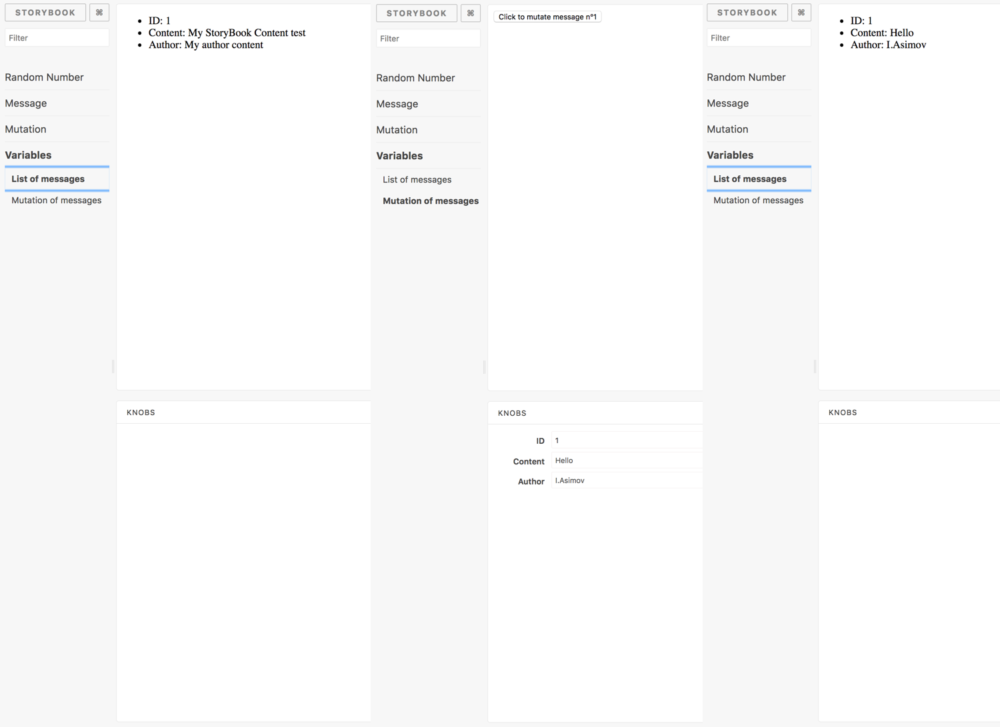

<p align="center">
    <p align="center">
        
    </p>
    <h3 align="center">Storybook Apollo Graphql addon</h3>
    <p align="center"><em>Test your Apollo graphql components with an offline graphql server</em><p>
    <p align="center">
        <a href="https://www.npmjs.com/package/storybook-addon-apollo-graphql"></a>
        <a href="https://www.npmjs.com/package/storybook-addon-apollo-graphql"></a>
        <a href="https://www.npmjs.com/package/storybook-addon-apollo-graphql"></a>
    </p>
</p>



## Usage

This library uses `graphql-tools` to build a schema and mock it.
For mocking reference read [here](https://www.apollographql.com/docs/graphql-tools/mocking.html#Customizing-mocks)

Create your stories with the `withApolloProvider` API.

```js
import React from 'react';
import { storiesOf } from '@storybook/react';
import { withApolloProvider } from '../../src';
import { gql, graphql } from 'react-apollo';

const Component = ({ data: { random } }) => <div>{random}</div>;
const ComponentWithGraphql = graphql(
  gql`
    {
      random
    }
  `
)(Component);

const typeDefs = `
    type Query {
        random: Int!
    }
`;

const mocks = {
  Query: () => ({
    random: () => Math.floor(Math.random() * 10),
  }),
};

export default () => {
  storiesOf('Random Number', module)
    .addDecorator(withApolloProvider({ typeDefs, mocks, schemaOptions: {}, mockOptions: {} }))
    .add('A random number query', () => <ComponentWithGraphql />);
};
```

You can optionally pass extra options:

- `schemaOptions` (passes options to `makeExecutableSchema`) [link](https://www.apollographql.com/docs/apollo-server/v2/api/graphql-tools.html#makeExecutableSchema)
- `mockOptions` (passes options to `addMockFunctionsToSchema`) [link](https://www.apollographql.com/docs/apollo-server/v2/api/graphql-tools.html#addMockFunctionsToSchema)
- `clientResolvers` (passes resolvers to `apollo-link-state`) [link](https://www.apollographql.com/docs/link/links/state.html#resolver)
- `clientDefaults` (passes defaults to `apollo-link-state`) [link](https://www.apollographql.com/docs/link/links/state.html#default)

## Examples

See [Examples here](example/stories)

## Testing

You can clone and run the demo

```sh
$ git clone https://github.com/alexandrebodin/storybook-addon-apollo-graphql storybook-addon-apollo-graphql
$ cd storybook-addon-apollo-graphql
$ yarn install
$ yarn storybook
$ open http://localhost:9009
```
